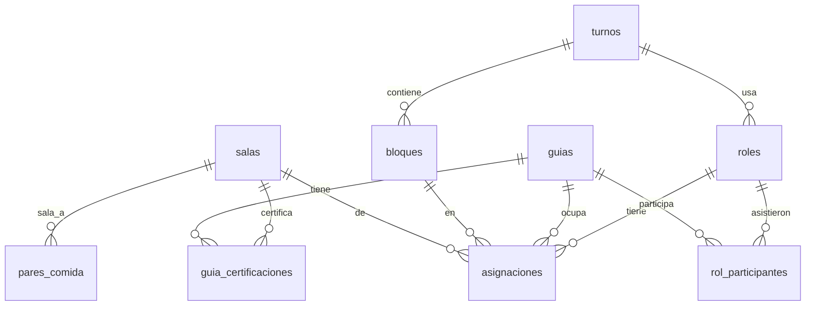

# Modelo de datos

## Diagrama

## Tablas

### `salas`

| Columna          | Tipo         | Notas                                   |
| ---------------- | ------------ | --------------------------------------- |
| `id`             | int PK       |                                         |
| `codigo`         | varchar(10)  | único, por ejemplo `H-21`               |
| `nombre`         | varchar(120) | `Planetario`                            |
| `es_funcion`     | bool         | exige certificación del guía            |
| `solo_super`     | bool         | exclusiva del Súper Guía (solo H-20)    |
| `comida_default` | time         | 13:30 o 14:00                           |
| `orden`          | int          | orden de despliegue                     |
| `activa`         | bool         | permite retirar una sala sin borrarla   |

### `pares_comida`

| Columna      | Tipo   | Notas                                |
| ------------ | ------ | ------------------------------------ |
| `id`         | int PK |                                      |
| `sala_a_id`  | FK     | hacia `salas`                        |
| `sala_b_id`  | FK     | hacia `salas`                        |

Restricción única sobre (`sala_a_id`, `sala_b_id`). El par se guarda una sola vez
con el id menor primero.

### `guias`

| Columna    | Tipo         | Notas                        |
| ---------- | ------------ | ---------------------------- |
| `id`       | int PK       |                              |
| `nombre`   | varchar(150) |                              |
| `es_super` | bool         | solo uno activo a la vez     |
| `activo`   | bool         | baja lógica                  |

### `guia_certificaciones`

| Columna    | Tipo | Notas          |
| ---------- | ---- | -------------- |
| `guia_id`  | FK   | PK compuesta   |
| `sala_id`  | FK   | PK compuesta   |

Solo tiene sentido para salas con `es_funcion = true`.

### `turnos` y `bloques`

`turnos`: `id`, `clave` (`fin_de_semana` | `matutino` | `vespertino`), `nombre`.

`bloques`: `id`, `turno_id`, `orden`, `hora_inicio`, `hora_fin`, `etiqueta`.
Único sobre (`turno_id`, `orden`).

### `roles`, `rol_participantes` y `asignaciones`

`roles`: `id`, `fecha`, `turno_id`, `estado` (`borrador` | `publicado`),
`created_at`. Único sobre (`fecha`, `turno_id`).

`rol_participantes`: `rol_id`, `guia_id`, `hora_comida`. Aquí vive la regla 4:
el rol registra quién asistió ese día y a qué hora comió.

`asignaciones`: `id`, `rol_id`, `guia_id`, `bloque_id`, `sala_id`. Con dos
índices únicos:

- (`rol_id`, `bloque_id`, `sala_id`) impide dos guías en la misma sala y bloque.
- (`rol_id`, `bloque_id`, `guia_id`) impide un guía en dos salas al mismo tiempo.

## Requisito por sala

No se guarda un campo `tipo_requisito` redundante; se deriva:

1. Si `solo_super` es verdadero, exige `guia.es_super`.
2. Si `es_funcion` es verdadero, exige una fila en `guia_certificaciones`.
3. En cualquier otro caso, sirve cualquier guía activo.
